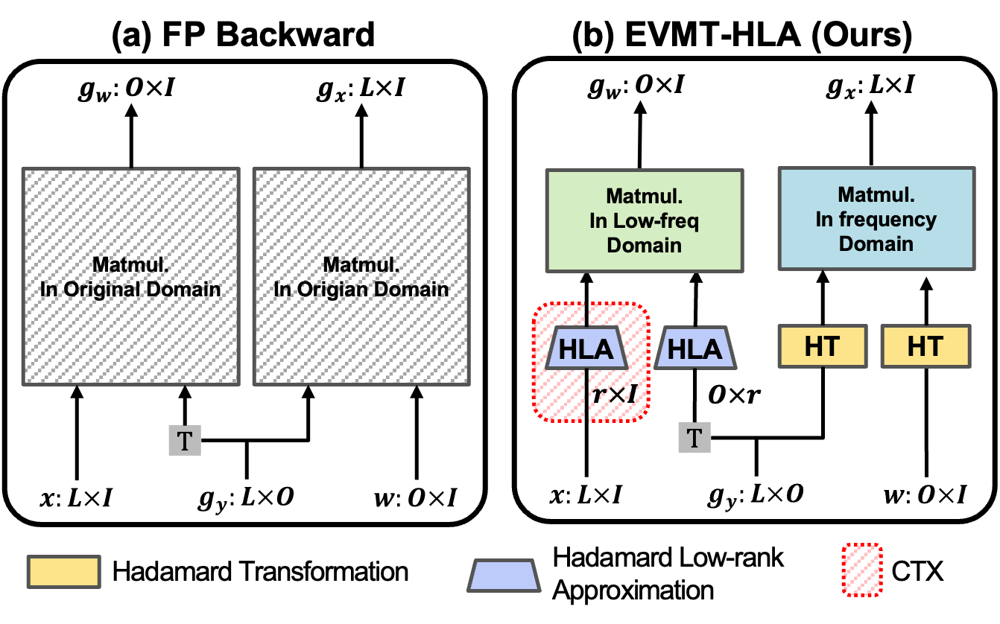

# EVMT-HLA: Efficient Vision Model Training via Hadamard Low-rank Approximation

## Introduction
By projecting gradients into a low-rank Hadamard space, we reduce memory usage by up to 50%—while preserving pretraining loss and accuracy in DeiT, and even improving performance in SimCLR, BYOL.

## Figures


## Usage
### DeiT
- First, clone the repository locally:
```
git clone https://github.com/facebookresearch/deit.git
```
- Then, install PyTorch 1.7.0+ and torchvision 0.8.1+ and [pytorch-image-models 0.3.2](https://github.com/rwightman/pytorch-image-models):

```
conda install -c pytorch pytorch torchvision
pip install timm==0.3.2
```

- Run training code.
```
./deit_train_repo.sh
```


### SimCLR
- Clone the repository of SimCLR locally:
```
git clone https://github.com/sthalles/SimCLR.git
```

- Then, install PyTorch 1.7.0+ and torchvision 0.8.1+ and [pytorch-image-models 0.3.2](https://github.com/rwightman/pytorch-image-models):
```
conda install -c pytorch pytorch torchvision
pip install timm==0.3.2
```

- Run training code.
```
./simclr_train.sh
```

